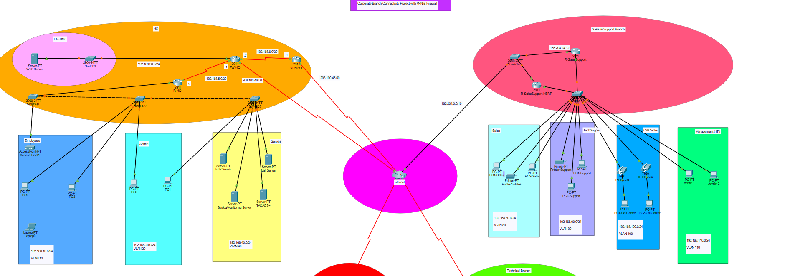
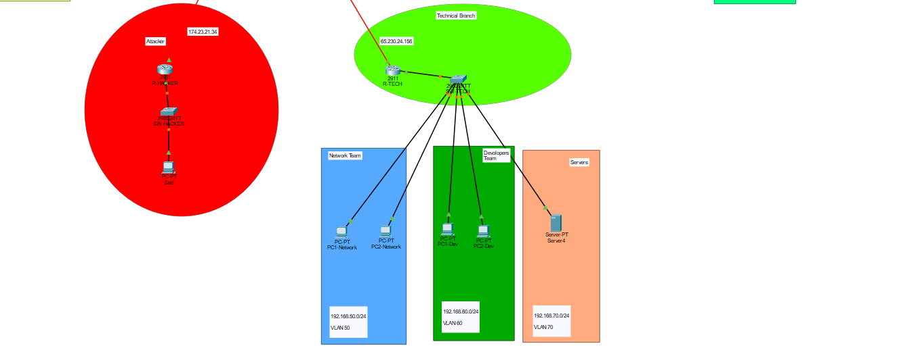

# Corporate Branch Connectivity Project with VPN & Firewall

🔧 **Implemented by:** Mahmoud Adel

---

## 📌 Project Overview

This project simulates a secure network infrastructure for a company with 3 branches  
(Cairo, Alexandria, and Aswan) using **Cisco Packet Tracer**.

---

## 🎯 Goals

- Connect branches securely using **Site-to-Site VPN**
- Apply **Zone-Based Firewall** for traffic control
- Ensure High Availability using **HSRP**
- Segment the network using **VLANs**
- Use **OSPF** and **Static Routing** together
- Implement services like **Web**, **FTP**, **Mail**, **Syslog**, and **TACACS**

---

## 🧱 Network Features

- 🔐 Site-to-Site VPN
- 🔥 Zone-Based Firewall
- 🧩 VLAN Segmentation
- 🔁 HSRP for Failover
- 🚦 OSPF + Static Routing
- 🌐 DMZ with Public Web Server
- 🧰 Internal Services:
  - TACACS
  - FTP
  - Syslog
  - Mail Server
  - Access Point

---

## 📷 Network Diagram

---

## 🗺️ Topology Views

  

---

## ✅ Tools Used

- Cisco Packet Tracer
- Cisco CLI
